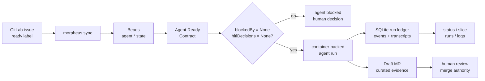
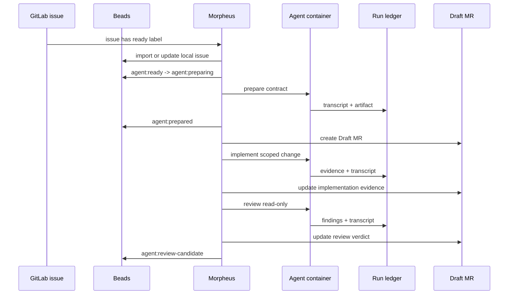

# Morpheus


**Dream with no limits. Run with evidence.**

Morpheus is agent ops for operators running AI work on real repositories.

> If it can't explain itself, it can't run.

In a dream, the agent can move fast, branch freely, and touch every layer. In a
real repository, that power needs shape: explicit intent, explicit auth, durable
state, sandboxed execution, transcripts, logs, review artifacts, and a human
merge decision. Morpheus is the layer between the dream and the repo.

[](https://github.com/NickSuomi/morpheus/releases)
[](https://github.com/NickSuomi/morpheus/actions/workflows/release-artifacts.yml)
[](docs/product/ALPHA.md)
[](LICENSE)

## Contents

- [Why Morpheus Exists](#why-morpheus-exists)
- [Operator Golden Path](#operator-golden-path)
- [Evidence Flow](#evidence-flow)
- [What Morpheus Controls](#what-morpheus-controls)
- [What Morpheus Refuses To Do](#what-morpheus-refuses-to-do)
- [Install](#install)
- [Set Up A Target Repo](#set-up-a-target-repo)
- [Run And Inspect Work](#run-and-inspect-work)
- [Health Model](#health-model)
- [Morpheus Vs Adjacent Tools](#morpheus-vs-adjacent-tools)
- [Repository Metadata](#repository-metadata)
- [Development](#development)
- [Docs](#docs)

## Why Morpheus Exists

AI agents are most dangerous when their work looks complete but cannot explain
itself. Real repo work fails when agents:

- start from vague issue text;
- mutate code without a durable contract;
- borrow implicit host credentials;
- scatter state across comments, shell history, logs, and local memory;
- leave reviewers guessing what changed, why, and how it was verified.

Morpheus makes agent work inspectable. It imports work, prepares an
Agent-Ready Contract, runs the agent in a configured container path, records a
ledgered run, updates a Draft MR with curated evidence, and leaves the merge to
a human.

## Operator Golden Path

```sh
curl -fsSL https://github.com/NickSuomi/morpheus/releases/latest/download/install.sh | sh
morpheus --version

cd /path/to/target-repo
morpheus setup

# You fill this manually. Morpheus never asks for secret values.
$EDITOR .morpheus/secrets/agent.env

docker build -f .morpheus/container/Dockerfile -t morpheus-agent:local .
morpheus doctor
morpheus daemon --once
morpheus daemon
```

Then mark a GitLab issue with the configured ready label, usually
`agent:ready`.

Inspect the dream after it runs:

```sh
morpheus status
morpheus slice <issue-id>
morpheus runs
morpheus run <run-id>
morpheus logs <run-id>
```

## Evidence Flow





## What Morpheus Controls

Morpheus owns the operator surface around agent work:

- CLI commands for setup, health, daemon runs, and inspection.
- GitLab intake through configured ready labels.
- Beads lifecycle state and Agent-Ready Contract metadata.
- Lane scheduling for preparation, implementation, and review.
- Container-backed agent execution.
- SQLite run ledger, run events, artifacts, logs, and transcript references.
- Draft MR review artifacts with contract, evidence, verification, risk, and
  reviewer findings.

The target repository owns its own domain truth:

- `morpheus.config.json`;
- `.morpheus/` prompts, skills, container profile, and secret example;
- verification commands;
- branch and GitLab project settings;
- product docs, ADRs, and target-specific agent instructions.

## What Morpheus Refuses To Do

The dream has rules.

- Morpheus does not auto-merge.
- Morpheus does not hide raw run evidence from the operator.
- Morpheus does not ask for secret values during setup.
- Morpheus does not silently use host Codex auth paths.
- Morpheus does not create `.sandcastle` target artifacts.
- Morpheus does not treat GitLab issue comments as primary lifecycle state.
- Morpheus does not run implementation when preparation produces weak intent,
  unresolved HITL decisions, or blockers.

## Install

Latest release:

```sh
curl -fsSL https://github.com/NickSuomi/morpheus/releases/latest/download/install.sh | sh
```

Pinned release:

```sh
curl -fsSL https://github.com/NickSuomi/morpheus/releases/latest/download/install.sh | MORPHEUS_VERSION=0.1.18 sh
```

Custom install dir:

```sh
curl -fsSL https://github.com/NickSuomi/morpheus/releases/latest/download/install.sh | MORPHEUS_INSTALL_DIR="$HOME/bin" sh
```

Installer behavior:

- downloads a runnable GitHub Release artifact for current OS/architecture;
- verifies `SHA256SUMS` when present;
- installs `morpheus`;
- verifies `morpheus --version`;
- prints next step: `cd target-repo && morpheus setup`.

No Homebrew or public npm install path is required for ALPHA.

## Set Up A Target Repo

```sh
cd /path/to/target-repo
morpheus setup
morpheus config show
```

Setup uses selector prompts for choices and readline-style prompts for text/path
values. It does not collect secret values.

Fill the agent auth file manually:

```sh
mkdir -p .morpheus/secrets
cp .morpheus/secrets/agent.env.example .morpheus/secrets/agent.env
$EDITOR .morpheus/secrets/agent.env
```

Build the target agent image:

```sh
docker build -f .morpheus/container/Dockerfile -t morpheus-agent:local .
```

Gate setup:

```sh
morpheus doctor
morpheus daemon --once
```

## Run And Inspect Work

Normal ALPHA operation:

```sh
glab auth status
morpheus sync
bd ready
morpheus daemon --once
morpheus daemon
```

Inspection commands:

```sh
morpheus status
morpheus slice <issue-id>
morpheus runs
morpheus run <run-id>
morpheus logs <run-id>
```

Manual lane commands exist for debugging:

```sh
morpheus prepare <issue-id>
morpheus implement <issue-id>
morpheus review <issue-id>
```

Prefer daemon mode for normal operation. Manual commands are escape hatches.

## Health Model

`morpheus doctor` reports:

- `OK`: prerequisite is present.
- `WARN`: visible risk, usually target-specific tooling.
- `FAIL`: blocker for safe setup or lane execution.

Blocking examples:

- invalid `morpheus.config.json`;
- missing Beads;
- `glab auth status` failure;
- Docker-compatible runtime unavailable;
- missing configured container image;
- missing required agent auth keys;
- unreadable workspace;
- unreadable ledger.

`WARN` is not hidden. It tells the operator what a later task may need.

## Morpheus Vs Adjacent Tools

| Tool family                    | Primary promise              | Morpheus position                                   |
| ------------------------------ | ---------------------------- | --------------------------------------------------- |
| Terminal coding agents         | Chat with code and edit fast | Runs are lifecycle-managed and ledgered             |
| IDE coding agents              | Work inside an editor        | Work is repo-local, daemonized, and review-oriented |
| Autonomous issue fixers        | Try to solve an issue        | Weak intent fails closed before implementation      |
| Agent platforms and workspaces | Broad agent environments     | Narrow operator path for real repo evidence         |
| CI systems                     | Run deterministic jobs       | Orchestrates agent work before human merge review   |

Morpheus is not trying to be the agent's personality. It is the ritual circle:
contract, lane, sandbox, ledger, artifact, review.

## Repository Metadata

Recommended GitHub presentation once the maintainer chooses final license and
release posture:

- Description: `Agent ops for operators running AI work on real repositories.`
- Topics: `ai-agents`, `agent-ops`, `developer-tools`, `gitlab`,
  `beads`, `typescript`, `effect`, `sqlite`, `docker`, `cli`.
- Social preview: `assets/brand/morpheus-og-card.png`.
- Website: leave empty until a real project site exists.
- License: [Apache-2.0](LICENSE) with [NOTICE](NOTICE) attribution.

## Development

```sh
pnpm install
pnpm build
pnpm run check
pnpm typecheck:fast
```

Run local CLI from source:

```sh
pnpm --filter @morpheus/cli morpheus --help
```

Build release artifacts:

```sh
scripts/package-release.sh --version 0.1.18 --only-os darwin --only-arch arm64
```

Install from local artifact by overriding URL/checksum:

```sh
MORPHEUS_RELEASE_URL="file:///path/to/morpheus-0.1.18-darwin-arm64.tar.gz" \
MORPHEUS_CHECKSUM_URL="" \
scripts/install.sh
```

Issue tracking uses Beads:

```sh
bd ready
bd list
bd show <id>
```

Commit hooks:

```sh
git config core.hooksPath .githooks
```

## Docs

Read in this order:

1. [Product PRD](docs/product/PRD.md)
2. [Context glossary](CONTEXT.md)
3. [Architecture](ARCHITECTURE.md)
4. [Architecture decisions](docs/adr/)
5. [Agent instructions](docs/agents/)
6. [ALPHA contract](docs/product/ALPHA.md)
7. [Fixture smoke target](docs/product/alpha-fixture-smoke.md)

The repo-owned architecture map lives at
`.understand-anything/knowledge-graph.json`. Use its tour first, then layers,
then targeted nodes and edges.
