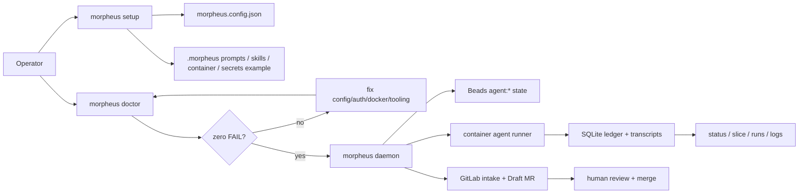
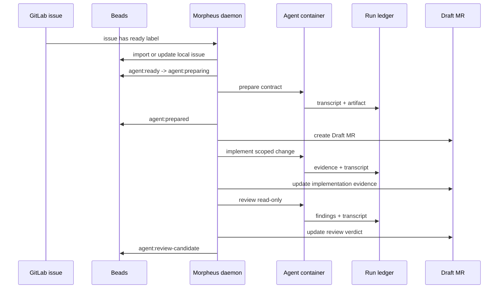

# Morpheus

Morpheus is a repo-local agent orchestration system for explainable software work.

> If it can't explain itself, it can't run.

Morpheus gives an operator one place to install, configure, run, inspect, and review AI-agent work against real repositories. It connects GitLab intake, Beads lifecycle state, container-backed agents, SQLite run ledgers, and Draft MR review artifacts without hiding the evidence.

## Contents

- [Why Morpheus Exists](#why-morpheus-exists)
- [What Alpha Means](#what-alpha-means)
- [Golden Path](#golden-path)
- [Operator Map](#operator-map)
- [Workflow](#workflow)
- [Install](#install)
- [Set Up A Target Repo](#set-up-a-target-repo)
- [Run And Inspect Work](#run-and-inspect-work)
- [Health Model](#health-model)
- [What Setup Writes](#what-setup-writes)
- [Troubleshooting](#troubleshooting)
- [Development](#development)
- [Docs](#docs)

## Why Morpheus Exists

Agent runs become risky when they:

- start from vague issue text;
- mutate repos without a durable contract;
- use implicit host credentials;
- scatter state across comments, logs, and local shells;
- leave reviewers guessing what happened.

Morpheus makes that work inspectable. A run must have explicit config, explicit auth, explicit lifecycle state, a recorded transcript, and review evidence before humans decide whether to merge.

## What Alpha Means

Morpheus ALPHA is the first end-to-end path where a maintainer can:

- install Morpheus from a GitHub Release curl installer;
- run guided target-repo setup;
- pass `morpheus doctor` with zero `FAIL` results;
- run `morpheus daemon --once`;
- execute a real container-backed agent task;
- inspect status, runs, slices, logs, transcripts, and MR evidence.

Canonical contract: [docs/product/ALPHA.md](docs/product/ALPHA.md).

## Golden Path

```sh
curl -fsSL https://github.com/NickSuomi/morpheus/releases/latest/download/install.sh | sh
morpheus --version

cd /path/to/target-repo
morpheus setup

# You fill this file manually. Morpheus never asks for secret values.
$EDITOR .morpheus/secrets/agent.env

docker build -f .morpheus/container/Dockerfile -t morpheus-agent:local .
morpheus doctor
morpheus daemon --once
morpheus daemon
```

Then mark a GitLab issue with the configured ready label, usually `agent:ready`.

Inspect work:

```sh
morpheus status
morpheus slice <issue-id>
morpheus runs
morpheus run <run-id>
morpheus logs <run-id>
```

## Operator Map



## Workflow



## Install

Latest release:

```sh
curl -fsSL https://github.com/NickSuomi/morpheus/releases/latest/download/install.sh | sh
```

Pinned release:

```sh
curl -fsSL https://github.com/NickSuomi/morpheus/releases/latest/download/install.sh | MORPHEUS_VERSION=0.1.6 sh
```

Custom install dir:

```sh
curl -fsSL https://github.com/NickSuomi/morpheus/releases/latest/download/install.sh | MORPHEUS_INSTALL_DIR="$HOME/bin" sh
```

Installer behavior:

- downloads a runnable GitHub Release artifact for current OS/architecture;
- verifies `SHA256SUMS` when present;
- installs `morpheus`;
- verifies `morpheus --version`;
- prints next step: `cd target-repo && morpheus setup`.

No Homebrew or public npm install path is required for ALPHA.

## Set Up A Target Repo

```sh
cd /path/to/target-repo
morpheus setup
morpheus config show
```

Setup uses selector prompts for choices and readline-style prompts for text/path values. It does not collect secret values.

Fill the agent auth file manually:

```sh
mkdir -p .morpheus/secrets
cp .morpheus/secrets/agent.env.example .morpheus/secrets/agent.env
$EDITOR .morpheus/secrets/agent.env
```

Build the target agent image:

```sh
docker build -f .morpheus/container/Dockerfile -t morpheus-agent:local .
```

Gate setup:

```sh
morpheus doctor
morpheus daemon --once
```

## Run And Inspect Work

Normal ALPHA operation:

```sh
glab auth status
morpheus sync
bd ready
morpheus daemon --once
morpheus daemon
```

Inspection commands:

```sh
morpheus status
morpheus slice <issue-id>
morpheus runs
morpheus run <run-id>
morpheus logs <run-id>
```

Manual lane commands exist for debugging:

```sh
morpheus prepare <issue-id>
morpheus implement <issue-id>
morpheus review <issue-id>
```

Prefer daemon mode for normal operation. Manual commands are escape hatches.

## Health Model

`morpheus doctor` reports:

- `OK`: prerequisite is present.
- `WARN`: visible risk, usually target-specific tooling.
- `FAIL`: blocker for safe setup or lane execution.

Blocking examples:

- invalid `morpheus.config.json`;
- missing Beads;
- `glab auth status` failure;
- Docker-compatible runtime unavailable;
- missing configured container image;
- missing required agent auth keys;
- unreadable workspace;
- unreadable ledger.

`WARN` is not hidden. It tells the operator what a later task may need.

## What Setup Writes

```txt
target-repo/
  morpheus.config.json
  .morpheus/
    prompts/
      prepare.md
      implement.md
      review.md
    skills/
      ...
    container/
      Dockerfile
      README.md
    secrets/
      agent.env.example
```

Setup also updates `.gitignore` for local ledgers, runs, logs, caches, and real secret env files.

Morpheus must not create `.sandcastle` target artifacts, private host auth paths, or real secret files containing tokens.

## Troubleshooting

| Symptom             | Check                                       | Fix                                                                 |
| ------------------- | ------------------------------------------- | ------------------------------------------------------------------- |
| `morpheus` missing  | `which morpheus`                            | Re-run installer or add install dir to `PATH`.                      |
| Config missing      | `morpheus config show`                      | Run `morpheus setup` in target repo.                                |
| GitLab auth fails   | `glab auth status`                          | Re-authenticate `glab` and verify project access.                   |
| Docker fails        | `docker info`                               | Start Docker Desktop, OrbStack, Colima, or remote Docker context.   |
| Agent image missing | `docker image inspect morpheus-agent:local` | Build image from `.morpheus/container/Dockerfile`.                  |
| Auth keys missing   | `morpheus doctor`                           | Fill `.morpheus/secrets/agent.env`; never paste secrets into setup. |
| Run failed          | `morpheus slice <issue-id>`                 | Inspect run events, logs, transcript, and MR evidence.              |

## Development

```sh
pnpm install
pnpm build
pnpm check
pnpm typecheck:fast
```

Run local CLI from source:

```sh
pnpm --filter @morpheus/cli morpheus --help
```

Build release artifacts:

```sh
scripts/package-release.sh --version 0.1.6 --only-os darwin --only-arch arm64
```

Install from local artifact by overriding URL/checksum:

```sh
MORPHEUS_RELEASE_URL="file:///path/to/morpheus-0.1.6-darwin-arm64.tar.gz" \
MORPHEUS_CHECKSUM_URL="" \
scripts/install.sh
```

Issue tracking uses Beads:

```sh
bd ready
bd list
bd show <id>
```

Commit hooks:

```sh
git config core.hooksPath .githooks
```

## Docs

Read in this order:

1. [Product PRD](docs/product/PRD.md)
2. [Context glossary](CONTEXT.md)
3. [Architecture](ARCHITECTURE.md)
4. [Architecture decisions](docs/adr/)
5. [Agent instructions](docs/agents/)
6. [ALPHA contract](docs/product/ALPHA.md)
7. [Fixture smoke target](docs/product/alpha-fixture-smoke.md)

The repo-owned architecture map lives at `.understand-anything/knowledge-graph.json`. Use its tour first, then layers, then targeted nodes and edges.
