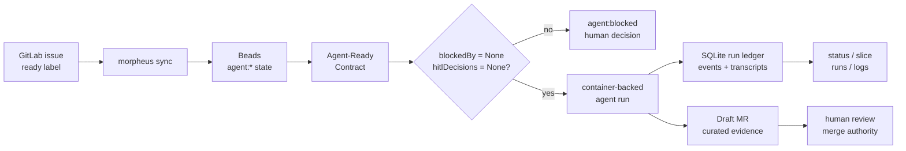
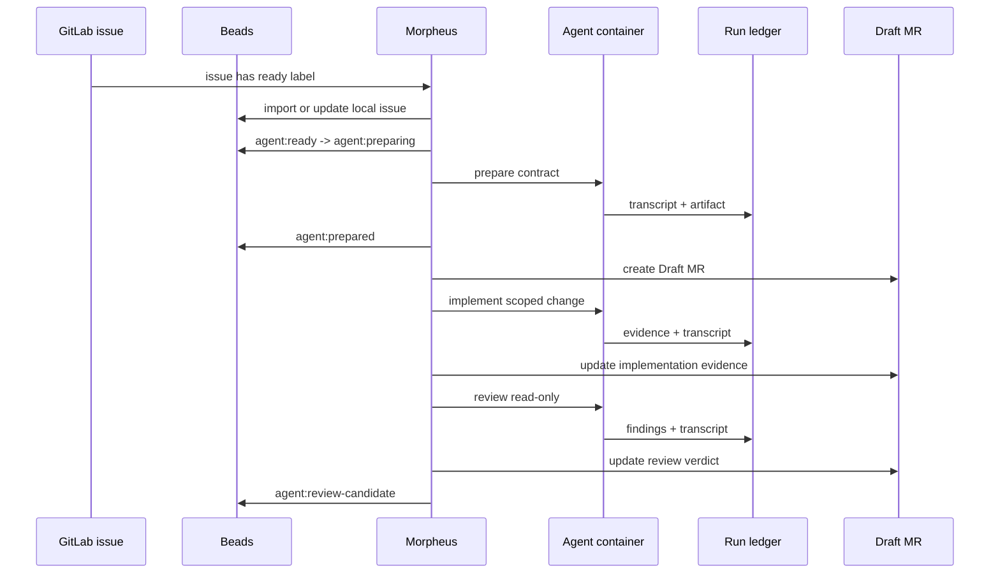

# Morpheus


**Dream with no limits. Run with evidence.**

Morpheus is agent ops for operators running AI work on real repositories.

> If it can't explain itself, it can't run.

In a dream, the agent can move fast, branch freely, and touch every layer. In a
real repository, that power needs shape: explicit intent, explicit auth, durable
state, sandboxed execution, transcripts, logs, review artifacts, and a human
merge decision. Morpheus is the layer between the dream and the repo.

[](https://github.com/NickSuomi/morpheus/releases)
[](https://github.com/NickSuomi/morpheus/actions/workflows/release-artifacts.yml)
[](docs/product/ALPHA.md)
[](LICENSE)

## Contents

- [Why Morpheus Exists](#why-morpheus-exists)
- [Operator Golden Path](#operator-golden-path)
- [Evidence Flow](#evidence-flow)
- [What Morpheus Controls](#what-morpheus-controls)
- [What Morpheus Refuses To Do](#what-morpheus-refuses-to-do)
- [Install](#install)
- [Set Up A Target Repo](#set-up-a-target-repo)
- [Run And Inspect Work](#run-and-inspect-work)
- [Health Model](#health-model)
- [Morpheus Vs Adjacent Tools](#morpheus-vs-adjacent-tools)
- [Repository Metadata](#repository-metadata)
- [Development](#development)
- [Docs](#docs)

## Why Morpheus Exists

AI agents are most dangerous when their work looks complete but cannot explain
itself. Real repo work fails when agents:

- start from vague issue text;
- mutate code without a durable contract;
- borrow implicit host credentials;
- scatter state across comments, shell history, logs, and local memory;
- leave reviewers guessing what changed, why, and how it was verified.

Morpheus makes agent work inspectable. It imports work, prepares an
Agent-Ready Contract, runs the agent in a configured container path, records a
ledgered run, updates a Draft MR with curated evidence, and leaves the merge to
a human.

## Operator Golden Path

```sh
curl -fsSL https://github.com/NickSuomi/morpheus/releases/latest/download/install.sh | sh
morpheus --version

cd /path/to/target-repo
morpheus setup

morpheus doctor
morpheus daemon --once
morpheus daemon
```

Then mark a GitLab issue with the configured ready label, usually
`agent:ready`.

Inspect the dream after it runs:

```sh
morpheus status
morpheus slice <issue-id>
morpheus runs
morpheus run <run-id>
morpheus logs <run-id>
```

## Evidence Flow





## What Morpheus Controls

Morpheus owns the operator surface around agent work:

- CLI commands for setup, health, daemon runs, and inspection.
- GitLab intake through configured ready labels.
- Beads lifecycle state and Agent-Ready Contract metadata.
- Lane scheduling for preparation, implementation, and review.
- Container-backed agent execution.
- SQLite run ledger, run events, artifacts, logs, and transcript references.
- Draft MR review artifacts with contract, evidence, verification, risk, and
  reviewer findings.

The target repository owns its own domain truth:

- `morpheus.config.json`;
- `.morpheus/` prompts, skills, container profile, and secret example;
- verification commands;
- branch and GitLab project settings;
- product docs, ADRs, and target-specific agent instructions.

## What Morpheus Refuses To Do

The dream has rules.

- Morpheus does not auto-merge.
- Morpheus does not hide raw run evidence from the operator.
- Morpheus does not silently use implicit or global host auth.
- Morpheus does not silently use host Codex auth paths.
- Morpheus does not create `.sandcastle` target artifacts.
- Morpheus does not treat GitLab issue comments as primary lifecycle state.
- Morpheus does not run implementation when preparation produces weak intent,
  unresolved HITL decisions, or blockers.

## Install

Latest release:

```sh
curl -fsSL https://github.com/NickSuomi/morpheus/releases/latest/download/install.sh | sh
```

Pinned release:

```sh
curl -fsSL https://github.com/NickSuomi/morpheus/releases/latest/download/install.sh | MORPHEUS_VERSION=0.1.26 sh
```

Custom install dir:

```sh
curl -fsSL https://github.com/NickSuomi/morpheus/releases/latest/download/install.sh | MORPHEUS_INSTALL_DIR="$HOME/bin" sh
```

Installer behavior:

- downloads a runnable GitHub Release artifact for current OS/architecture;
- verifies `SHA256SUMS` when present;
- installs `morpheus`;
- verifies `morpheus --version`;
- prints next step: `cd target-repo && morpheus setup`.

No Homebrew or public npm install path is required for ALPHA.

## Set Up A Target Repo

```sh
cd /path/to/target-repo
morpheus setup
morpheus config show
```

Setup uses selector prompts for choices and readline-style prompts for text/path
values. It can collect required agent auth secrets interactively, or accept
explicit non-interactive secrets through `--auth-secret KEY=VALUE`. Secret
values are written only to the configured target-local auth env file.

One-command setup:

```sh
morpheus setup --yes \
  --gitlab-project group/project \
  --auth-secret OPENAI_API_KEY="$OPENAI_API_KEY" \
  --build \
  --once
```

Manual auth remains supported:

```sh
morpheus setup --yes --gitlab-project group/project
$EDITOR .morpheus/secrets/agent.env
```

Gate setup:

```sh
morpheus doctor
morpheus daemon --once
```

## Run And Inspect Work

Normal ALPHA operation:

```sh
glab auth status
morpheus sync
bd ready
morpheus daemon --once
morpheus daemon
```

Inspection commands:

```sh
morpheus status
morpheus slice <issue-id>
morpheus runs
morpheus run <run-id>
morpheus logs <run-id>
```

Manual lane commands exist for debugging:

```sh
morpheus prepare <issue-id>
morpheus implement <issue-id>
morpheus review <issue-id>
```

Prefer daemon mode for normal operation. Manual commands are escape hatches.

## Health Model

`morpheus doctor` reports:

- `OK`: prerequisite is present.
- `WARN`: visible risk, usually target-specific tooling.
- `FAIL`: blocker for safe setup or lane execution.

Blocking examples:

- invalid `morpheus.config.json`;
- missing Beads;
- `glab auth status` failure;
- Docker-compatible runtime unavailable;
- missing configured container image;
- missing required agent auth keys;
- unreadable workspace;
- unreadable ledger.

`WARN` is not hidden. It tells the operator what a later task may need.

## Morpheus Vs Adjacent Tools

Morpheus sits between coding agents, CI, and review tools. It does not replace
them; it adds the missing repo-agent lifecycle around them.

| Reference | Promise | Where the promise breaks | What Morpheus adds | Morpheus limit |
| --- | --- | --- | --- | --- |
| [Trigger.dev](https://trigger.dev/docs) | Reliable background jobs with queues, retries, logs, traces, dashboards, and replay. | App jobs explain task execution, not whether an AI coding run had valid intent, isolated auth, repo state, transcripts, and review evidence. | Agent-Ready Contracts, Beads lifecycle state, sandboxed repo runs, local transcripts, and MR artifacts for agent work. | Not a general app job scheduler. |
| [GitLab CI/CD](https://docs.gitlab.com/ci/pipelines/) | Deterministic pipelines with jobs, stages, dependency graphs, retries, cancel, and MR visibility. | CI proves commands passed or failed; it does not prepare ambiguous issues, supervise coding agents, or explain agent decisions before review. | A pre-CI agent lifecycle: prepare, implement, review, ledger, logs, and curated MR evidence before human merge. | CI remains the deterministic verification layer. |
| [GitHub Copilot coding agent](https://docs.github.com/en/copilot/how-tos/use-copilot-agents/cloud-agent/start-copilot-sessions) | Start background coding sessions from GitHub, IDEs, CLI, Slack, Jira, Linear, and other entry points, then create PRs. | Delegation is easy, but weak issue intent, hidden runtime context, and scattered session evidence still leave maintainers reconstructing what happened. | Fail-closed preparation, explicit target config/auth, run ledger, sandbox transcript paths, and review artifacts. | Built for Beads/GitLab-oriented operator flows, not GitHub-native assignment. |
| [Claude Code](https://code.claude.com/docs/en/overview) | Powerful terminal-first coding agent with CI automation, MCP, memory, hooks, skills, background agents, and SDKs. | A strong agent still needs external lifecycle control when multiple repo tasks must be prepared, isolated, audited, and reviewed consistently. | The wrapper around the agent: contract, lane, sandbox, ledger, artifact, review. | Not the agent personality or model runtime. |
| [Roo Code](https://roocodeinc.github.io/Roo-Code/) and [Cline](https://docs.cline.bot/cline-overview) | Editor/terminal agents with filesystem access, terminal control, modes, approvals, SDKs, and task-board-style work. | IDE approval flows are good for active humans, but weaker for daemonized issue intake, durable run history, and MR-centered operator review. | Repo-local daemon flow with explicit state transitions, local evidence, and human merge authority. | Not an IDE sidebar or editor replacement. |
| [OpenHands](https://docs.openhands.dev/overview/introduction) | Software-agent SDK plus CLI/local GUI for running agents locally or at cloud scale. | Broad agent platforms still leave each team to define issue readiness, review artifacts, target auth, and operator evidence policy. | A narrow, opinionated repo-ops path from issue state to inspectable MR evidence. | Not a general-purpose agent platform. |
| [Paperclip](https://github.com/paperclipai/paperclip) | React/Node control plane for teams of AI agents with org charts, budgets, goals, governance, and dashboards. | Company metaphors and goal dashboards are broad; repo engineering still needs precise contracts, worktrees, verification, and merge review. | Concrete target-repo runs with contract gates, sandbox execution, ledgered artifacts, and MR handoff. | Not an AI company simulator. |
| [CodeRabbit](https://docs.coderabbit.ai/) | AI code review, planning, PR comments, Slack agent workflows, and IDE/CLI review surfaces. | Review tools see proposed changes, but they do not own the full run lifecycle that produced those changes. | Run evidence before review: issue contract, implementation transcript, verification summary, review lane findings, and MR artifact. | Human merge authority remains outside Morpheus. |

## Repository Metadata

Recommended GitHub presentation once the maintainer chooses final license and
release posture:

- Description: `Agent ops for operators running AI work on real repositories.`
- Topics: `ai-agents`, `agent-ops`, `developer-tools`, `gitlab`,
  `beads`, `typescript`, `effect`, `sqlite`, `docker`, `cli`.
- Social preview: `assets/brand/morpheus-og-card.png`.
- Website: leave empty until a real project site exists.
- License: [Apache-2.0](LICENSE) with [NOTICE](NOTICE) attribution.

## Development

```sh
pnpm install
pnpm build
pnpm run check
pnpm typecheck:fast
```

Run local CLI from source:

```sh
pnpm --filter @morpheus/cli morpheus --help
```

Build release artifacts:

```sh
scripts/package-release.sh --version 0.1.26 --only-os darwin --only-arch arm64
```

Install from local artifact by overriding URL/checksum:

```sh
MORPHEUS_RELEASE_URL="file:///path/to/morpheus-0.1.26-darwin-arm64.tar.gz" \
MORPHEUS_CHECKSUM_URL="" \
scripts/install.sh
```

Issue tracking uses Beads:

```sh
bd ready
bd list
bd show <id>
```

Commit hooks:

```sh
git config core.hooksPath .githooks
```

## Docs

Read in this order:

1. [Product PRD](docs/product/PRD.md)
2. [Context glossary](CONTEXT.md)
3. [Architecture](ARCHITECTURE.md)
4. [Architecture decisions](docs/adr/)
5. [Agent instructions](docs/agents/)
6. [ALPHA contract](docs/product/ALPHA.md)
7. [Fixture smoke target](docs/product/alpha-fixture-smoke.md)

The repo-owned architecture map lives at
`.understand-anything/knowledge-graph.json`. Use its tour first, then layers,
then targeted nodes and edges.
