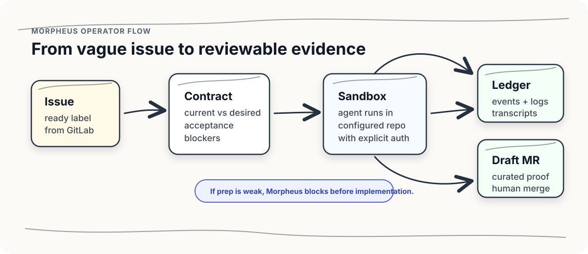

# Morpheus

[](https://github.com/NickSuomi/morpheus/releases)
[](https://github.com/NickSuomi/morpheus/actions/workflows/release-artifacts.yml)
[](docs/product/ALPHA.md)
[](LICENSE)

**Dream with no limits. Run with evidence.**

Morpheus is agent ops for operators running AI work on real repositories. It
turns a ready GitLab issue into a prepared, isolated, reviewable agent run,
records evidence, updates a Draft MR, and leaves the merge to a human.

> If it can't explain itself, it can't run.



## Quick Start

Install the latest release:

```sh
curl -fsSL https://github.com/NickSuomi/morpheus/releases/latest/download/install.sh | sh
morpheus --version
```

Set up a target repository:

```sh
cd /path/to/target-repo
morpheus setup
morpheus doctor
```

`morpheus setup` guides you through GitLab, the container runtime, and Codex
authentication. ChatGPT subscription login is the default; an OpenAI API key is
also supported.

Start Morpheus:

```sh
morpheus daemon --once # process one tick
morpheus daemon        # keep watching
```

Add the configured ready label, usually `agent:ready`, to a GitLab issue.
Morpheus prepares the issue, implements it in an isolated worktree/container,
runs an independent review, and updates the Draft MR with evidence.

The archived Trigger.dev remote-dashboard spike is documented in the
[Trigger.dev execution dashboard spike report](docs/product/trigger-dev-execution-dashboard.md).
It is not a shipped or supported Morpheus integration.

## Codex Authentication

Each target uses one auth source: ChatGPT subscription or OpenAI API key.

### ChatGPT Subscription

Interactive setup completes the login automatically:

```sh
morpheus setup
```

You can also manage it directly:

```sh
morpheus auth login codex
morpheus auth login codex --device
morpheus auth status
morpheus auth logout codex
```

Morpheus keeps this login in its own private auth home. It does not read or
modify your normal `~/.codex` login. Subscription-backed runs are serialized
within one Morpheus process in the current ALPHA.

For explicit non-interactive device login:

```sh
morpheus setup --yes \
  --gitlab-project group/project \
  --auth chatgpt \
  --device-auth
```

### OpenAI API Key

API-key mode is the better fit for CI and unattended environments:

```sh
morpheus setup --yes \
  --gitlab-project group/project \
  --auth api-key

$EDITOR .morpheus/secrets/agent.env
morpheus doctor
```

Add `OPENAI_API_KEY` to the generated, gitignored env file. Morpheus passes only
the configured keys into agent runs.

## Operate

```sh
morpheus status           # current lanes and failures
morpheus slice <issue-id> # full issue story
morpheus runs             # run history
morpheus run <run-id>     # one run
morpheus logs <run-id>    # local transcript
morpheus sync             # reconcile GitLab intake
```

Normal flow:

1. GitLab issue receives `agent:ready`.
2. Preparation builds and validates the Agent-Ready Contract.
3. Implementation runs in an isolated target workspace.
4. Independent review checks the result.
5. The Draft MR receives curated evidence.
6. A human reviews and merges.

Morpheus never auto-merges. Weak intent, unresolved decisions, conflicting
state, missing auth, or failed verification stop the flow visibly.

## Requirements

- Git
- authenticated `glab`
- Docker-compatible runtime
- Beads (`bd`) in the target repository
- Codex CLI for ChatGPT subscription auth

`morpheus doctor` checks the active target and prints concrete recovery steps.

## Development

```sh
pnpm install
pnpm check
```

Run the CLI from source:

```sh
pnpm --filter @morpheus/cli morpheus --help
```

Project docs:

- [Product PRD](docs/product/PRD.md)
- [ALPHA contract](docs/product/ALPHA.md)
- [Context glossary](CONTEXT.md)
- [Architecture](ARCHITECTURE.md)
- [Architecture decisions](docs/adr/)
- [Agent instructions](docs/agents/)

Morpheus is [Apache-2.0](LICENSE) licensed with [NOTICE](NOTICE) attribution.
